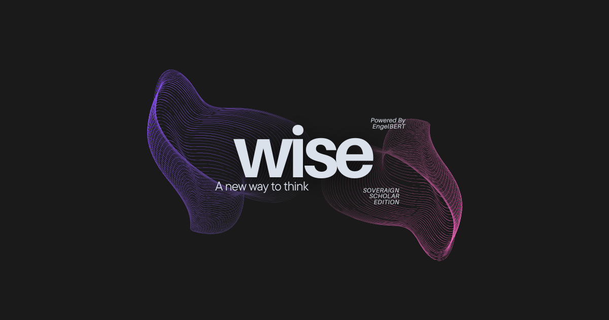

🌓

<!-- HERO -->

  
  <h1>Engelbert</h1>
  
The Thinking Operating System

<!-- PROBLEM -->

  <h3>🚫 The Problem: The AI Butler is a Dead End</h3>
  
Today's AI systems are hyper-efficient <strong>"AI Butlers."</strong> They automate tasks and make us faster, but they don't make us <em>smarter</em>. The fundamental relationship hasn't changed: we are still operators commanding a reactive machine. This is a bottleneck for deep, creative thought.

<!-- VISION -->
<h2>Our Vision: The AI Lab Partner</h2>

We believe the true revolution is an **"AI Lab Partner"**—a Socratic system designed for cognitive augmentation. Engelbert is our architectural vision for this new paradigm. It's an "attention shield" that doesn't just complete tasks, but uses them as raw material for a deeper cognitive partnership.

<!-- USER STORY -->

  <h3>Meet Wise: A Day in the Life</h3>
  
To understand Engelbert, consider Sabina, a developer using our flagship application, <strong>Wise</strong>. She's been documenting a project for weeks in her local **"Second Brain."** After a bug report, she asks Wise: <em>"Review my recent commits on the auth flow and my original design notes from last month."</em>

  
Later, while she's debugging, the **Insight Engine** surfaces a non-intrusive insight: <em>"I noticed your <code>handleAuthRedirect</code> function conflicts with a design note from three weeks ago: 'Ensure all redirects are server-side validated.' This might be the source of the bug."</em>

  
Intrigued, Sabina activates the **"Agora" Cognitive Lens** to debate the fix, then switches to the **"Muse" Lens** to brainstorm a more elegant solution. <strong>This isn't a faster workflow—it's a deeper mode of thought.</strong>

Figure 1: The "Wise: Sovereign Scholar Edition" interface—your personal thinking environment.

<!-- CORE INNOVATIONS -->
<h2>Core Innovations</h2>

  

    <h4>🔄 The DPES Loop</h4>
    
A Deconstruct-Plan-Execute-Synthesize loop powers our kernel, complete with a "Critic Agent" for self-correction.

  

  

    <h4>💡 The Insight Engine</h4>
    
A computational "dream cycle" that passively analyzes your local knowledge to surface non-obvious connections.

  

  

    <h4>🎭 Cognitive Lenses</h4>
    
User-directed reasoning styles (Scholar, Muse, Reflective, Agora) that adapt the AI's entire mode of interaction.

  

  

    <h4>🏠 Cognitive Sovereignty</h4>
    
Your thoughts, data, and models stay on your device. Local-first by default, with an optional "Cloud Bridge" for external tools.

  

<!-- ROADMAP -->
<h2>Development Roadmap Active</h2>

  

    <h4>Phase 1: Proof of Concept (Current)</h4>
    
Building "Wise: Sovereign Scholar Edition" for the Google Gemma 3n Impact Challenge. Focusing on local-first execution (Ollama) and the core Scholar/Muse lenses.

  

  

    <h4>Phase 2: Validation & Open-Source (Q4 2025)</h4>
    
Formal user studies measuring cognitive augmentation. First open-source release of the core orchestration framework.

  

  

    <h4>Phase 3: Platform Beta (2026)</h4>
    
All four Cognitive Lenses, an initial agent SDK, and advanced multi-timescale memory systems.

  

<!-- CTA (CALL TO ACTION) -->

  <h2>Be Among the First to Think Differently</h2>
  
Join the waitlist for early access to the "Wise" experimental app. Experience what it's like to have a true cognitive partner.

  <a href="https://tally.so/r/3q8PBG" target="_blank">Join the Wise Waitlist</a>
  <a href="https://github.com/daveAnalyst/EngelBERT" target="_blank">View on GitHub</a>

<!-- TEAM -->
<h2>The Team</h2>

  

    <h3>David Angaya</h3>
    
My background in Economics taught me to think in terms of systems and human behavior. I fell in love with AI as the ultimate tool to shape these systems. My passion is architecting AI products that don't just solve technical problems, but augment the human experience.

  

  

    <h3>Davin Dewanto</h3>
    
I'm the engineer who loves bringing ambitious visions to life. With a background in CS and a focus on backend architecture and AI implementation, my passion is building the robust, scalable infrastructure that makes magical user experiences possible.

  

<!-- FOOTER -->

  
This project is grounded in the research of Engelbart, Licklider, and Kay. <a href="https://doi.org/10.5281/zenodo.16020726">Read the full academic paper</a>.

  
© 2025 The Engelbert Project | <a href="mailto:davidomungala3@gmail.com">Contact Us</a> | <a href="https://twitter.com/Omungala_dave">Follow Updates</a>

