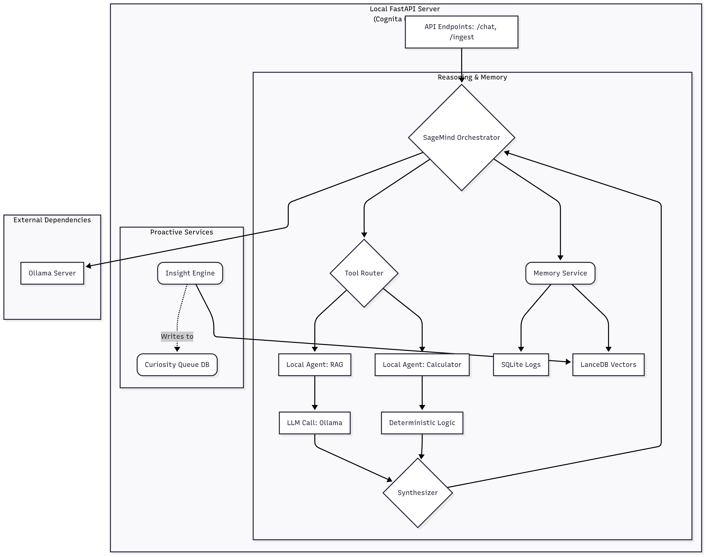

<!-- I will keep your CSS and Dark Mode script as it's functional and well-done. -->

🌓

<!-- HERO SECTION: Start with the Vision & the Product -->

  
  <h1>EngelBERT</h1>
  
The Thinking Operating System

The dominant paradigm of human-computer interaction—the reactive GUI—is a bottleneck for deep, creative thought. We propose **EngelBERT**, an architectural vision for a 'thinking operating system' that inverts this model. Instead of an 'AI Butler' for task automation, Engelbert functions as a Socratic **'AI Lab Partner'** for cognitive augmentation.

This document outlines our vision, the core architecture, and the roadmap for building this new generation of sovereign, proactive AI systems.

---

## A Day in the Life with Wise

To understand our vision, consider Sabina, a developer using our flagship application, **Wise**. She has been documenting her project for weeks, storing code snippets and design notes in her local **"Second Brain."** After pushing a new feature, she gets a bug report. She asks Wise: *"Review my recent commits related to the user authentication flow and my original design notes from last month."*

Later, while she is debugging, the **Insight Engine**, running its passive 'dream cycle', surfaces a non-intrusive suggestion: *"I noticed the logic in your `handleAuthRedirect` function conflicts with a constraint you mentioned three weeks ago: 'Ensure all redirects are server-side validated.' This might be the source of the bug."*

Intrigued, Sabina activates the **"Agora" Cognitive Lens** to debate the architectural trade-offs of the fix, then switches to the **"Muse" Lens** to brainstorm a more elegant solution. This is not just a faster workflow; it is a deeper mode of thought, augmented by a true cognitive partner.

*Figure 1: A conceptual mockup of the "Wise: Sovereign Scholar Edition" UI.*

## The Engelbert Architecture

Our architecture is composed of three concentric layers: a central Cognitive Core, an Augmented Workspace (Wise), and a future Agent Economy.

*Figure 2: The Engelbert Ecosystem, featuring the Kernel, Workspace, and a planned Agent Economy.*

#### Key Innovations

*   **The DPES Loop:** A Deconstruct-Plan-Execute-Synthesize loop that powers our intent-driven kernel, complete with a "Critic Agent" for self-correction.
*   **The Insight Engine:** A computational "dream/drift cycle" that passively analyzes a user's local knowledge base to surface non-obvious connections.
*   **Cognitive Lenses:** User-directed reasoning styles (Scholar, Muse, Reflective, Agora) that adapt the AI's entire mode of interaction.

## The Journey So Far

Our mission began with a prototype at a Google AI Hackathon and has evolved into a full-fledged vision for a new computing paradigm. We are currently in active development for the **Google Gemma 3n Impact Challenge**, building the "Wise: Sovereign Scholar Edition" as a proof-of-concept for the Engelbert architecture.

*You can read the full academic vision paper [here](./path/to/your/paper.pdf) (link to the PDF) or view the code on [GitHub](https://github.com/daveAnalyst/EngelBERT).*

---

<!-- THE NEW, FOCUSED CALL-TO-ACTION SECTION -->

  <h2>Join the Waitlist</h2>
  
Be among the first to experience a new way of thinking. Join the waitlist for early access to the "Wise" experimental app.

  <!-- This is where you would embed your Tally.so form. For now, a link is a great placeholder. -->
  <a href="YOUR_TALLY_SO_FORM_LINK" target="_blank">Join the Wise Waitlist</a>

---

## The Team

  

    <h3>David Angaya</h3>
    
My background is in Economics, which taught me to think in terms of systems and human behavior. I fell in love with AI as the ultimate tool to shape these systems. My passion is architecting AI products that don't just solve technical problems, but augment the human experience.

  

  

    <h3>Davin Dewanto</h3>
    
I'm the engineer who loves bringing ambitious visions to life. With a background in CS and a focus on backend architecture and AI implementation, my passion is building the robust, scalable infrastructure that makes magical user experiences possible. I build the "how" that powers Dave's "what if."

  

  <a href="mailto:davidomungala3@gmail.com">Contact Us</a> | <a href="https://github.com/daveAnalyst/EngelBERT">GitHub Repository</a> | © 2025 EngelBERT Project

